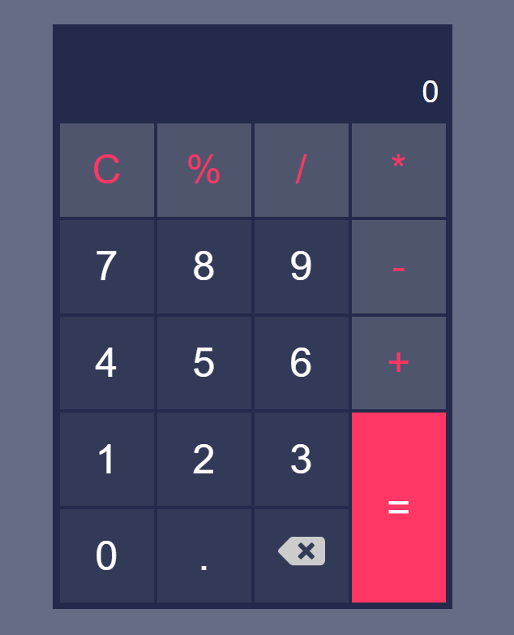

<h1 align="center">Calculator</h1>

The project simulates a simple calculator, with basic operations.

  <a href="#technologies">Technologies</a>&nbsp;&nbsp;&nbsp;|&nbsp;&nbsp;&nbsp;
  <a href="#operations">Operations</a>&nbsp;&nbsp;&nbsp;|&nbsp;&nbsp;&nbsp;
  <a href="#installation">Installation</a>&nbsp;&nbsp;&nbsp;|&nbsp;&nbsp;&nbsp;
  <a href="#layout">Layout</a>&nbsp;&nbsp;&nbsp;&nbsp;&nbsp;&nbsp;

 

  

<h1 id='technologies'>🖱️ Technologies</h2>

This project was made with the following technologies/libraries:

- HTML
- [Live-server](https://marketplace.visualstudio.com/items?itemName=ritwickdey.LiveServer) (Extension to auto-reload the page when it's modified)
- SASS
- [Sass Compiler](https://marketplace.visualstudio.com/items?itemName=ritwickdey.live-sass) (Extension to compile .scss files to pure CSS)
- JavaScript
- Git
- Github

 

<h1 id='operations'>📟 Operations</h1>

<h3 align='center'>The Website has 5 <strong>operations:</strong></h3>

- <strong>Addition</strong>
- <strong>Subtraction</strong>
- <strong>Multiplication</strong>
- <strong>Division</strong>
- <strong>Modulus</strong> (remainder of a division)

 

<h3 align='center'>It still has <strong>3 functions</strong>, which are essential for a calculator:</h3>

- <strong>Clear</strong> (removes all entered numbers from the display)
- <strong>Remove</strong> (removes the last digit from the display)
- <strong>Equals</strong> (calculates the operation typed in the display)

 

<h1 id='layout'>🖥️ Layout</h1>

 

> To see the Deploy, check [THIS LINK](https://calculator-rho-cyan.vercel.app/)

 

<h1 id='installation'>📤 Installation</h1>

> <h3>Firstly, you need to <strong>clone the project</strong> on your machine:</h3>
 

<code>git clone https://github.com/cristian-sbardelotto/calculator</code>

 

> <h3>To contribute, you need to use the <strong>Live Sass Compiler</strong> to modify the style:</h3>

 

> [Download here.](https://marketplace.visualstudio.com/items?itemName=ritwickdey.live-sass)

 

----

 

> <h3>To <strong>run the project</strong> on your browser, install the live-server extension, right click on the HTML file and go to 'Open with Live Server' option.</h3>

 

> [Download here.](https://marketplace.visualstudio.com/items?itemName=ritwickdey.LiveServer)

 

---

<h2 align='center'>Enjoy this project!</h2>

Developed with ❤️ by <strong>Cristian Sbardelotto</strong>

